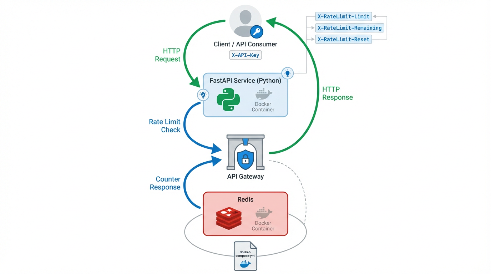

# 🚀 Redis Rate Limiter



A high-performance, lightweight, and scalable API rate limiting solution built with **FastAPI** ⚡ and **Redis** 🧠. Designed to protect your services from abuse while maintaining blazing fast response times.


**🔗 Links:**
- **GitHub Repository**: [https://github.com/atharvabaodhankar/redis-rate-limiter](https://github.com/atharvabaodhankar/redis-rate-limiter)
- **Docker Hub**: [baodhankaratharva/redis-rate-limiter-api](https://hub.docker.com/repository/docker/baodhankaratharva/redis-rate-limiter-api)

## ✨ Features

- **High Performance**: Built with FastAPI for lightning-fast API responses
- **Redis-Powered**: Leverages Redis for distributed rate limiting across multiple instances
- **Docker Ready**: Complete containerization with Docker Compose
- **Rate Limit Headers**: Standard HTTP headers for client-side rate limit awareness
- **Configurable Limits**: Easy to adjust rate limits and time windows
- **API Key Based**: Secure rate limiting per API key
- **Production Ready**: Lightweight and scalable architecture

## 🏗️ Architecture

The system follows a simple yet effective architecture:

1. **Client** sends requests with `X-API-Key` header
2. **FastAPI Server** validates the API key and checks rate limits
3. **Redis** stores and manages rate limit counters with automatic expiration
4. **Response** includes rate limit headers and appropriate status codes

### Rate Limiting Algorithm

- Uses Redis `INCR` command for atomic counter increments
- Implements sliding window with automatic key expiration
- Default: **5 requests per 10 seconds** per API key
- Returns standard rate limit headers in responses

## 🚀 Quick Start

### Prerequisites

- Docker and Docker Compose
- Python 3.11+ (for local development)

### Using Docker Compose (Recommended)

1. **Clone the repository**
   ```bash
   git clone https://github.com/atharvabaodhankar/redis-rate-limiter.git
   cd redis-rate-limiter
   ```

2. **Start the services**
   ```bash
   docker-compose up -d
   ```

3. **Test the API**
   ```bash
   curl -H "X-API-Key: test-key" http://localhost:8000/
   ```

### Using Pre-built Docker Image

You can also use the pre-built Docker image from Docker Hub:

```bash
# Pull the image
docker pull baodhankaratharva/redis-rate-limiter-api

# Run with Redis
docker run -d --name redis redis:7
docker run -d -p 8000:8000 --link redis:redis baodhankaratharva/redis-rate-limiter-api
```

### Local Development

1. **Install dependencies**
   ```bash
   pip install -r requirements.txt
   ```

2. **Start Redis** (using Docker)
   ```bash
   docker run -d -p 6379:6379 redis:7
   ```

3. **Run the application**
   ```bash
   uvicorn app.main:app --reload --host 0.0.0.0 --port 8000
   ```

## 📡 API Reference

### Endpoints

#### `GET /`
Main endpoint that demonstrates rate limiting functionality.

**Headers:**
- `X-API-Key` (required): Your API key for rate limiting

**Response Headers:**
- `X-RateLimit-Limit`: Maximum requests allowed in the time window
- `X-RateLimit-Remaining`: Number of requests remaining in current window
- `X-RateLimit-Reset`: Seconds until the rate limit resets

**Responses:**

✅ **200 OK** - Request successful
```json
{
  "message": "Request successful"
}
```

❌ **401 Unauthorized** - Missing API key
```json
{
  "detail": "Missing API key"
}
```

❌ **429 Too Many Requests** - Rate limit exceeded
```json
{
  "detail": "Too many requests"
}
```

### Example Usage

```bash
# Successful request
curl -H "X-API-Key: my-api-key" http://localhost:8000/

# Response headers will include:
# X-RateLimit-Limit: 5
# X-RateLimit-Remaining: 4
# X-RateLimit-Reset: 10
```

## ⚙️ Configuration

### Rate Limit Settings

Edit `app/limiter.py` to modify rate limiting behavior:

```python
RATE_LIMIT = 5      # Maximum requests per window
WINDOW = 10         # Time window in seconds
```

### Redis Configuration

Update Redis connection settings in `app/limiter.py`:

```python
r = redis.Redis(
    host="redis",       # Redis host
    port=6379,          # Redis port
    decode_responses=True
)
```

## 🧪 Testing

### Manual Testing

Test rate limiting with multiple requests:

```bash
# Send 6 requests quickly to trigger rate limiting
for i in {1..6}; do
  curl -H "X-API-Key: test-key" http://localhost:8000/
  echo ""
done
```

### Expected Behavior

- First 5 requests: `200 OK` with decreasing `X-RateLimit-Remaining`
- 6th request: `429 Too Many Requests`
- After 10 seconds: Rate limit resets

## 🐳 Docker Services

The application consists of two services:

- **api**: FastAPI application (port 8000)
- **redis**: Redis cache (port 6379)

### Service Management

```bash
# Start services
docker-compose up -d

# View logs
docker-compose logs -f

# Stop services
docker-compose down

# Rebuild and restart
docker-compose up --build -d
```

## 📊 Monitoring

### Redis Monitoring

Connect to Redis to monitor rate limiting:

```bash
# Connect to Redis CLI
docker-compose exec redis redis-cli

# Monitor rate limit keys
KEYS rate:*

# Check specific key
GET rate:test-key
TTL rate:test-key
```

### Application Logs

```bash
# View API logs
docker-compose logs -f api

# View Redis logs
docker-compose logs -f redis
```

## 🔧 Customization

### Adding Authentication

Extend the API key validation in `app/main.py`:

```python
def validate_api_key(api_key: str) -> bool:
    # Add your API key validation logic
    valid_keys = ["key1", "key2", "key3"]
    return api_key in valid_keys
```

### Multiple Rate Limit Tiers

Implement different limits per API key:

```python
RATE_LIMITS = {
    "premium": {"limit": 100, "window": 60},
    "standard": {"limit": 10, "window": 60},
    "basic": {"limit": 5, "window": 60}
}
```

### Adding Metrics

Integrate with monitoring solutions:
- Prometheus metrics
- Application logs
- Redis monitoring
- Health check endpoints

## 🤝 Contributing

1. Fork the repository
2. Create a feature branch
3. Make your changes
4. Add tests if applicable
5. Submit a pull request

## 📄 License

This project is licensed under the MIT License - see the LICENSE file for details.

## 🆘 Troubleshooting

### Common Issues

**Redis Connection Error**
```
redis.exceptions.ConnectionError: Error connecting to Redis
```
- Ensure Redis is running: `docker-compose up redis -d`
- Check Redis logs: `docker-compose logs redis`

**Port Already in Use**
```
Error starting userland proxy: listen tcp 0.0.0.0:8000: bind: address already in use
```
- Change port in `docker-compose.yml` or stop conflicting services

**Missing API Key**
- Always include `X-API-Key` header in requests
- Verify header name matches exactly (case-sensitive)

---

Built with ❤️ using FastAPI and Redis